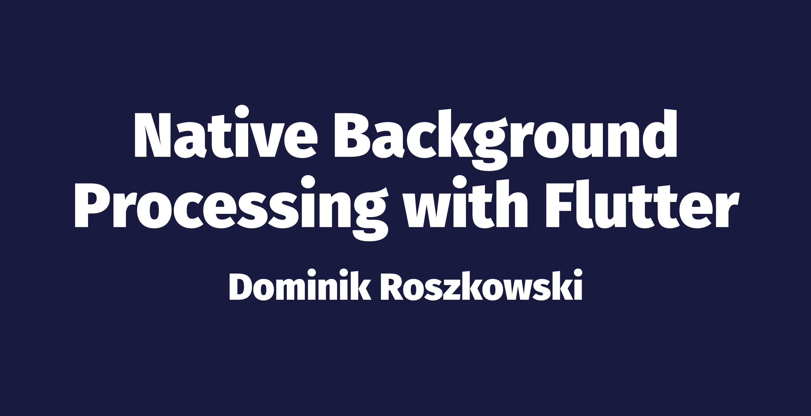

# Native background processing with Flutter

This is a companion repository for the talk "Native background processing with Flutter". Go to [roszkowski.dev/background](https://roszkowski.dev/background) for details.
