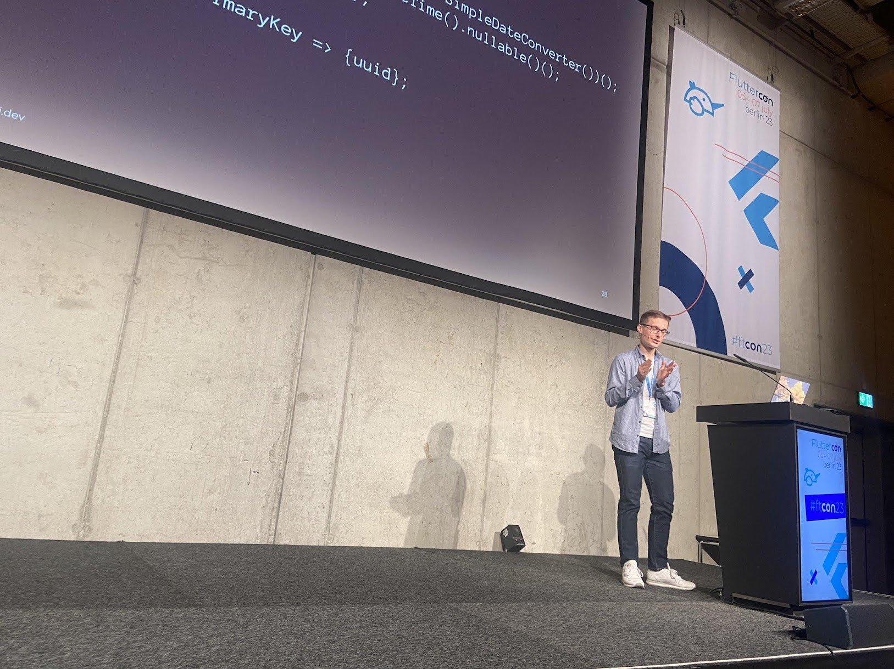
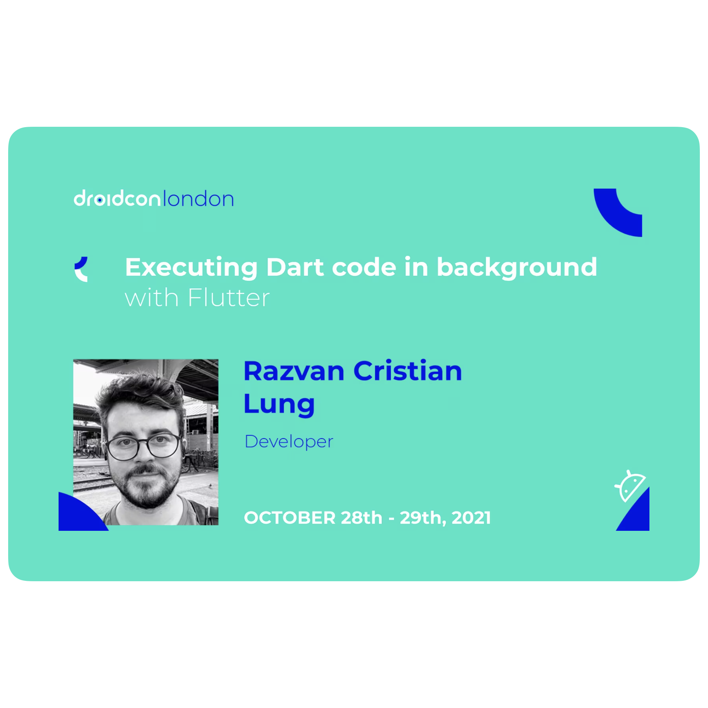
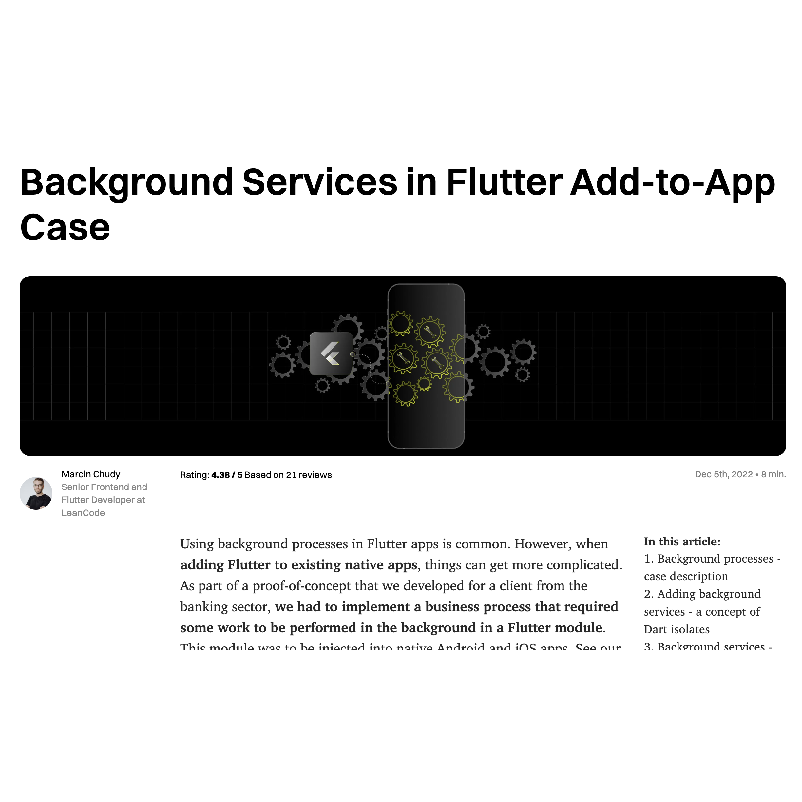
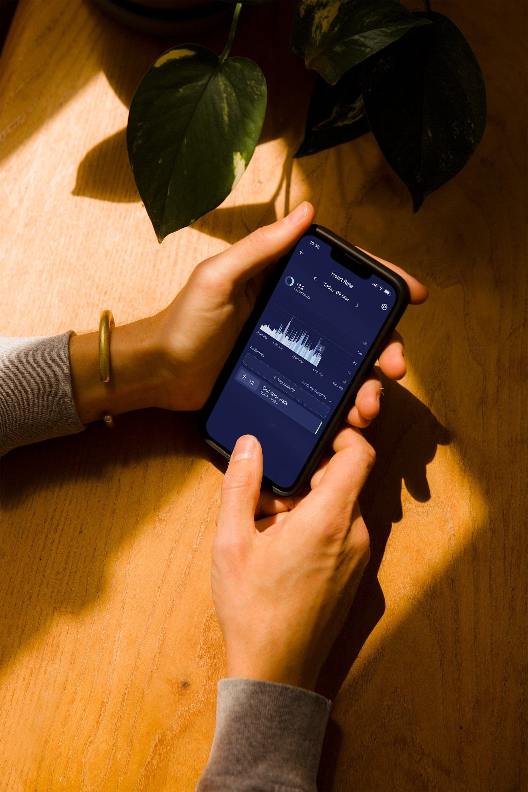

footer: Fluttercon 2024 | @OrestesGaolin | roszkowski.dev
background-color: #171A42
build-lists: true
slide-transition: fadeThroughColor(#171A42, 1.0)
autoscale: true

## Native Background Processing with Flutter

### Dominik Roszkowski

---

<!-- [.column] -->

<!--  -->

<!-- [.column] -->

[.footer: false]


---

# What kind of apps do you build?


👉 Slido.com with **#1924827**

---

# What does it take to build a mobile app?

UI/UX, state management, a11y, deeplinks, notifications, **offline support**, CI/CD, in-app purchases, navigation, force upgrade, l10n, events, modularization, code push, OS permissions, testing, crashes, fragmentation, dependencies, migrations, stores, feature flags, widgets, tracking, attribution...

and?

^As mobile, and specifically Flutter developers we face a lot of various challenges and topic every day. From building UIs, animations, through in-app purchases, navigation, system permissions, to feature flags and dealing with the app stores.

^ And as you grow as a mobile developer, you eventually reach the point, where you have to carry out some process when the app is not running. And as you probably see already, this slide misses one particular topic.

---

# Background Processing

^ Whether it's backend driven data update, or on-device cleanup, you need to step into the background processing. As Flutter developers we can coast for several years without ever writing a single line of native code, but in this particular case understanding how the underlying native implementation works is crucial. I'd argue that learning how to do background processing can have bigger impact on your development than any of the topics from the previous slide.

^ My journey with background processing spans from the times when I was building backend systems with .NET. Having workers or job schedulers was just a part of day to day backlog. Then when I worked with Xamarin at LeanCode we also have done a bit of background processing on mobile, but it used to be a bit detached from the native platform. Only when I joined Visible and had to migrate our app to offline-first paradigm, I realized how naive my approach has been for all these years.

---



# [fit] My view on background processing

<!--  -->

^ This may be actually a good thing with Flutter that in certain way it constrains developers to consider mostly the active section of the app lifecycle, the one when app is in the foreground and user is actively interacting with it. For most of the users in the wild the app will just not operate when not on the screen - whether it's due to the power saving limitations, or people automatically swiping away the app once they're done with whatever was happening in the app.

^ Our app - Visible - is a health tracker for people with chronic illnesses. It's like a fitbit for ill. For instance we have a wearable armband integrated via Bluetooth.

^ At Visible we had to embrace background processing with Flutter as primary framework. It took some time but currently we have a quite significant portion of the app written natively, mostly all the BLE integrations. All of that needs to work when app is not active, for instance it needs to react to Bluetooth armband coming back in range. Over the last 2 years we also made some serious mistakes when trying to solve it, so today I'd like to share with you some of the lessons I learned on the way.

---

# Agenda

- Use cases for background processing
- Ways to achieve it in Flutter apps
- Dart or...

^ Let's see what's our agenda for today. First let's just explore couple of use cases. Then we'll get into the interesting details, and at the end we may discuss whether using Dart for background processing is reasonable option in the long run.

---

[.build-lists: false]

# Agenda

- **Use cases for background processing**
- Ways to achieve it in Flutter apps
- Dart or...?

---

# Use-case #1

Offline-first app:

You should be able to
synchronize it out-of-lifecycle

^Our first use case, that at Visible we had to add aside from Bluetooth integration is out-of-lifecycle data synchronization. I guess that's quite obvious in offline-first app where we keep most of the user data in the local database. It may happen that they used the app in poor network conditions, so overnight we want to sync the data up and down to the backend.

^Wondering if anybody in the room had to solve something similar?

---


^In our case we have a set of background processes written in Dart that are run at a specified cadence, and here you can see an example of it in action.

---

# Use-case #2

Need to fetch or upload for
longer than 10-20 seconds?

You should to be able
to run it outside of the main process

^Another quite popular use-case is downloading or uploading some significant amount of data to the cloud. It makes me sad sometimes how fragmented and unknown this is among Flutter developers, but I'd argue that in the many cases going with native, out-of-lifecycle upload is the way to go.

---


^Here you can see a simple example of OneDrive synchronizing new photos using a foreground service on Android. iOS is a bit trickier but in some circumstances it's possible to achieve similar experience there as well. If big apps do it, why wouldn't you as well?

---

# Use-case #3

Refreshing app data

When content becomes
available on the backend

^Another example, that also works well with offline-first apps is refreshing the app content on backend trigger e.g. by receiving a silent push notification. This in turn triggers a short sync process to fetch the data to be shown to the user when they come back to the app.

---

# Use-case #4


Using BLE accessory

Waking up the app when in range

^And finally the use case that's similar to what we do at Visible, but this can be applied to any BLE accessory. For instance in case of Tesla mobile app, I think it gets woken up when the device BLE radio is detected in range to unlock the door. In case of Visible we get these triggers when user turns on the armband.

---

"In Flutter you can just use isolates"

~ first answer in Google

🤔

^ All right, having all of these use cases in mind, some of which you might have implemented already, what are our options?

^ When you look for background processing keyword online, the most common answer you'll get is "isolates".

---

# 🤔

^ And in fact in some sense to do a background work in Flutter you have to use isolates. In reality this is just part of the answer and to do it correctly you may need to look deeper.

---

# Agenda

[.build-lists: false]

- Use cases for background processing
- **Ways to achieve it in Flutter apps**
- Dart or...?

---

# Isolates

- they require Flutter engine to run
- can be invoked from main engine
- or new engine can be spun from native code

^ First of all isolates work within Dart VM, so in case of a mobile app it means you probably need to run Flutter engine. They can be invoked from your main engine and let you run Dart code asynchronously without causing UI jank. And that's the main way we leverage isolates at Visible. Sometimes there may be several of them running at the same time but they're mostly imperceptible for the users.

---

# Isolates: `compute()` with graphql

multiple responses decoded without jank

[.code-highlight: 4]

```dart
Future<Map<String, dynamic>?> isolateHttpResponseDecoder(
  http.Response httpResponse,
) async =>
    await compute(jsonDecode, httpResponse.body)
        as Map<String, dynamic>?;
```

^For instance our graphql client uses `compute` function which spins up a new isolate to decode string response to json. With big responses it would cause a significant jank if not for the isolate doing the job.

---

## Invoking isolates from native platform

- when push notification received
- when foreground service/live activity is running
- when user taps on widget

^However, for me the more interesting part is running the Dart code from a background job triggered natively. There may be several reasons for that like push notification callback, user action on foreground service or iOS live activity, or perhaps user tapping on a home screen widget.

---

[.text: alignment(left), size(0.8)]

## Invoking isolates from native platform

1. Create _main_ method channel and register it on both sides
2. Start foreground service (FS) via _main_ method channel
   1. Within the FS create new Flutter engine
   2. New Flutter engine entry-point is a top-level function
   3. Create _service_ method channel for the new engine
   4. Communicate between FS and top-level function
3. Stop the service

^ In some way all of these leverage similar mechanism of invoking a new flutter engine from the Flutter Engine cache pool. For a simple one-off case that I'm going to show today you can do it in 3 major steps:

^First create a method channel to receive information on the native side.

^Then start a foreground service (or any other background job) that will launch a new Flutter engine. This new engine needs to point to a top-level function marked with VM entry-point. The function that you specify will be called as if it was you main function of the app.

^In that function you can freely create new method channel that will communicate back and forth with the service.

^Once done, you can just stop the service or cancel the job.

---

[.hide-footer]


^Let's see how it can be done with Android foreground service.

---

[.hide-footer]


---

[.hide-footer]


---

[.hide-footer]


---

[.hide-footer]


---

[.hide-footer]


---

[.hide-footer]


---

[.hide-footer]


---

[.column]



[.column]



---

[.build-lists: false]

[.text: alignment(left)]

Some production-ready plugins:

- `flutter_background_fetch` by Transistor Software
- `workmanager` by fluttercommunity
- `flutter_background_service` by ekasetiawans
- `flutter_downloader` / `background_downloader` / `flutter_uploader`

^There are some great community plugins doing almost exactly this. Whether you just need to run a quick background process or spin up a foreground service that will use Dart, you can leverage these. However, I think it's quite important to know how it all works under the hood, and in fact it's not that mysterious.

---

[.build-lists: false]

# Agenda

- Use cases for background processing
- Ways to achieve it in Flutter apps
- **Dart or native code?**

^Okay, we all know now that you can run Dart code but my hot take for today is actually the suggestion that maybe in some cases it would be better to just write this code in platform-specific language and environment?

---

## Hot take 🔥

## Maybe write your code natively?

^Take for example podcast playing app that needs to fetch episodes overnight. It doesn't make sense to spin up Flutter and Dart just to fetch audio files and update the local database with new file references. Instead of trying to unify this process in Dart you may spend this time implementing these processes in platform code.

---

## What options do we have?

[.text: alignment(left)]

[.column]

## Android

- Foreground Service
- Background Work: WorkManager/Worker/JobScheduler...
- User-initiated data transfers

[.column]

## iOS

# 🦗

^There are several ways to achieve it natively, we already seen the Foreground Service on Android, but with new Android releases it becomes less and less suggested option. The Android team actually discourages developers from using Foreground Services and instead try to use other background work schemes, or in most of the cases fallback to _user-initiated data transfers_ which is a new concept in Android 14. They are not affected by system quotas but at the same time there are some different rules of stopping and cancelling them. It would be enough for a separate talk at Droidcon to explain all the edge cases.

---



## Running a Foreground Service

- At Visible we decided it's the most reliable way for our main use case.

- With the scale of BLE integration, SQLite database, notifications, widgets we decided to just maintain it in Kotlin/Swift.

---

# iOS makes background processing tricky

[.text: text-scale(0.8)]

|                     | Short Task                           | Long Task                      |
| ------------------- | ------------------------------------ | ------------------------------ |
| **BGTaskScheduler** | `BGAppRefreshTask`                   | `BGProcessingTask`             |
| **Hacky way** 😉    | Push Notification Background Updates | State Restoration App Relaunch |

^On iOS the main recommended way to run any background process is BGTaskScheduler. This class can accept your requests to run a background job via callback sometime in the future. From what I heard iOS was never designed to have background processes, so in some way it's still a workaround, although officially supported.

^There are also some hacky ways to trigger a background code execution. For instance you may send a high priority push notification that will have some time to execute a callback.
One other way which we utilized at Visible is something called _state restoration app relaunch_.

---

[.code-highlight: all]
[.code-highlight: 1-7]
[.code-highlight: 8-11]
[.code-highlight: 12-19]

```swift
// didFinishLaunchingWithOptions
BGTaskScheduler.shared.register(
  forTaskWithIdentifier: "fluttercon.hello.db_cleaning", using: nil //Info.plist
  ) { task in
    self.handleDatabaseCleaning(task: task as! BGProcessingTask)
    // run Flutter engine if needed
}

func applicationDidEnterBackground(_ application: UIApplication) {
    scheduleDatabaseCleaningIfNeeded()
}

func scheduleDatabaseCleaningIfNeeded() {
    let request = BGProcessingTaskRequest(identifier: "fluttercon.hello.db_cleaning")
    request.requiresNetworkConnectivity = false
    request.requiresExternalPower = true

    try BGTaskScheduler.shared.submit(request)
}
```

^When it comes to underlying implementation the iOS code is quite straightforward, maybe a bit confusing due to syntax, but in general after you registered your task id, you can submit it to BGTaskScheduler for execution at a later time. Each task has a set of constraints e.g. it can run when the phone gets connected to the charger.

^And as you can imagine the scheme here is exactly the same if you want to run Dart code - you need to spin up the Flutter engine with a top-level function as entry point.

---

Trick we use at Visible (iOS)

# [fit] State Preservation and Restoration

# [fit] Bluetooth State Restoration app relaunch

^The trick we used at Visible to let us have long-running background processing is called Bluetooth State Restoration App Relaunch. It essentially means that Visible is running as long as the BLE accessory is connected with the phone. It also wakes up the app when it comes back in range.

---

Android

# [fit] Companion device pairing

^Similar behavior can be achieved on Android with Companion Device API, but we haven't migrated to it just yet.

---

[.text: alignment(left)]

# Recap and Final Remarks

- Building with Flutter ➡️ understand all platforms
- Challenges with bg work and new Android policy
  - Android 15 - force close stops pending intents
- Try it yourself!

---

# Learn more

[.build-lists: false]

[.text: alignment(left)]

- **Norbert Kozsir:** _Compilers, Virtual Machines and Code Analysis - What makes Dart and Flutter run_
  - Wednesday 1:40 PM / Dart Den
- **Lucas Goldner:** _Saving data before the app getting killed! Easy state restoration with Flutter_
  - Wednesday 3:45 PM / Widget Way
- **Daco Harkes, Hossein Yousefi:** _The past, present, and future of native interop_
  - Thursday 4:10 PM / Flutter Forest
- **Domen Lanišnik:** _Guide to Foreground Services_
  - Friday 11:55 AM / Things
- Links at [**roszkowski.dev/background**](https://roszkowski.dev/background)

---

This was "Native Background Processing with Flutter"

Reference materials and slides
[**roszkowski.dev/background**](https://roszkowski.dev/background)


Find me online using: **@OrestesGaolin** / **Dominik Roszkowski**

<!-- - https://www.droidcon.com/2021/11/22/executing-dart-code-in-background-with-flutter/?unapproved=23281&moderation-hash=a01970f2cffdb436b12dccdacffc6867#comment-23281
- https://www.dhiwise.com/post/work-wonders-with-flutter-workmanager-ultimate-guide
- https://www.xavor.com/blog/the-significance-of-background-tasks-in-flutter-app-development/
- https://leancode.co/blog/background-services-in-flutter-add-to-app
- https://www.droidcon.com/2020/10/10/workmanager-clever-delegate-for-deferrable-background-tasks/
- https://developer.apple.com/videos/play/wwdc2019/707/
- https://developer.android.com/about/versions/14/changes/fgs-types-required
- https://www.droidcon.com/2023/11/15/a-guide-to-using-foreground-services-and-background-work-in-android-14/
- https://developer.android.com/about/versions/14/changes/user-initiated-data-transfers
- https://docs.flutter.dev/packages-and-plugins/background-processes -->

```

```
